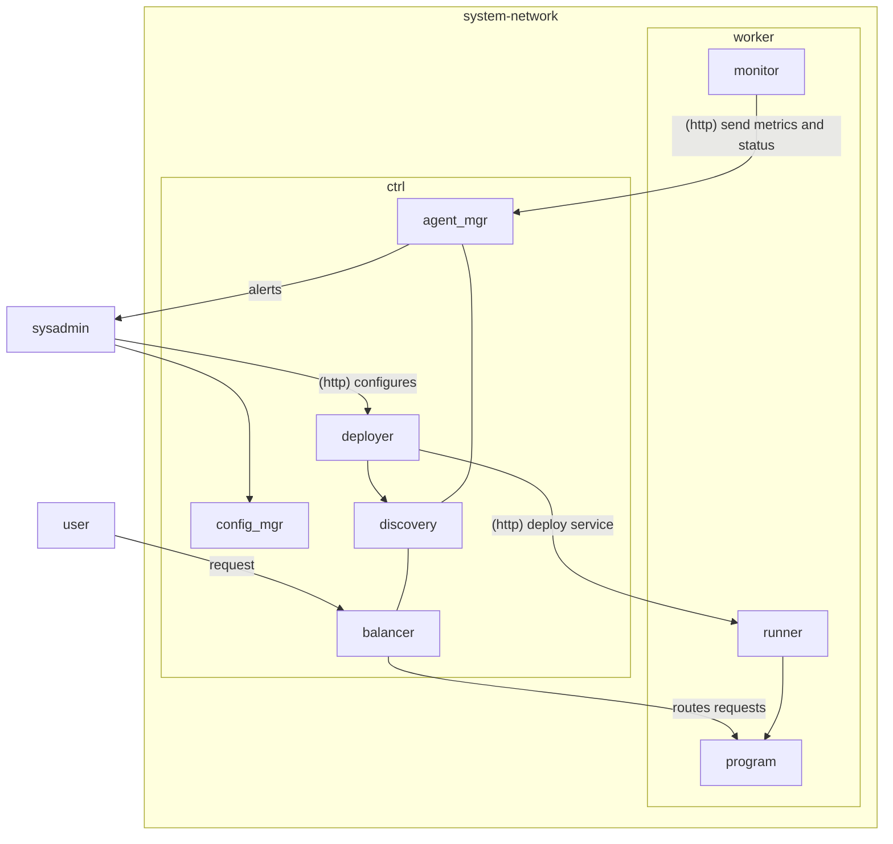
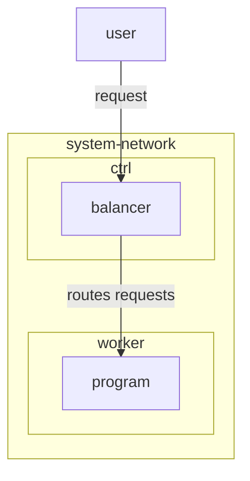
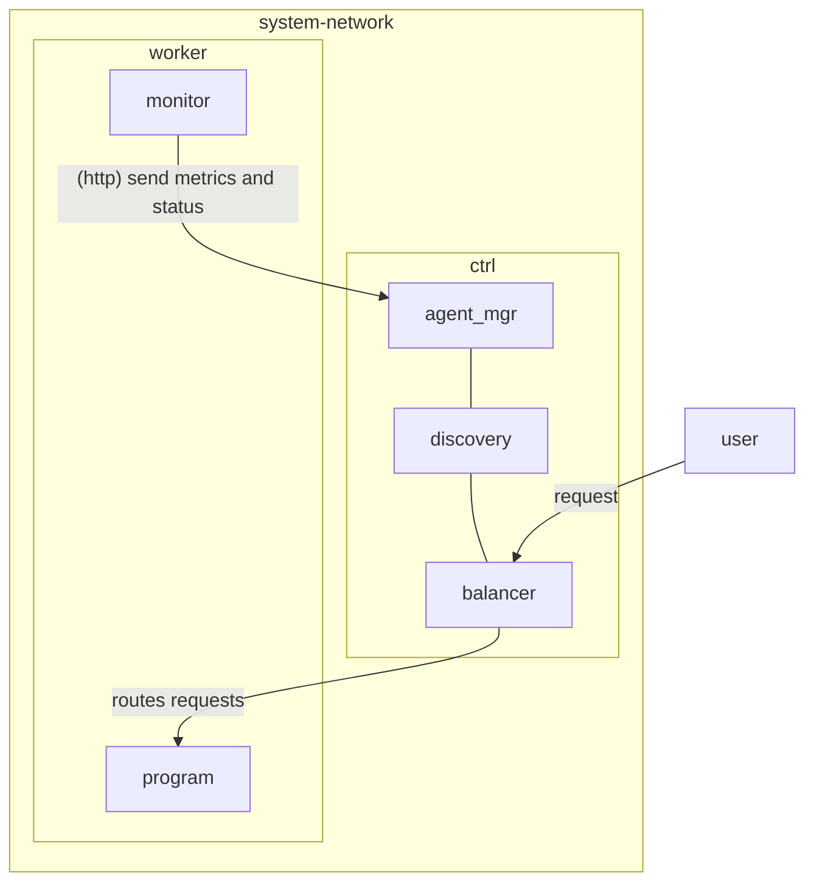

# Tucano

why use one computer if u can use 5 with Tucano lol

<div class="abs-br m-6 flex gap-2">
  <a href="https://github.com/esfericos/tucano" target="_blank" alt="GitHub" title="Github"
    class="text-xl slidev-icon-btn opacity-50 !border-none !hover:text-white">
    <carbon-logo-github />
  </a>
</div>

---
transition: fade-out
---

# Indíce

<Toc maxDepth="1"></Toc>

---
layout: default
---

# O que é Tucano?

<v-click>
⏰ Simples <span v-mark.red="1">scheduler de seviços</span> capaz de gerenciar workloads diversos em um sistema composto por vários computadores.

<br/>
<br/>
<v-click>
⚖ Além disso, o scheduler também é responsavel pelo <span v-mark.red="2">balanceamento de carga</span>, de modo a fazer um service discovery para rotear requisições de usuários ao seus respectivos serviços.
</v-click>
</v-click>

---

## transition: fade-out

# Diagrama

<div style="display:flex; align-items: center; justify-content:center">



</div>

---
transition: slide-up
level: 2
---

# Descrição dos componentes.

Explicação dos componentes dos diagramas.

## 🎮 Controller

|                      |                                                                            |
| -------------------- | -------------------------------------------------------------------------- |
| <kbd>deployer</kbd>  | Aceita a configuração estática de um serviço e inicia o processo de deploy |
| <kbd>balancer</kbd>  | Balaceia a carga aos nós correspondentes                                   |
| <kbd>agent_mgr</kbd> | Recebe informações dos agents e lida com eventuais "mortes" de workers.    |
| <kbd>discovery</kbd> | Mantém informações necessárias para realizar service discovery.            |

---
transition: slide-left
---

# Descrição dos componentes.

Explicação dos componentes dos diagramas.

## ⚒ Worker

|                    |                                                                                         |
| ------------------ | --------------------------------------------------------------------------------------- |
| <kbd>monitor</kbd> | Coleta métricas do worker e envia periodicmente ao controlador                          |
| <kbd>runner</kbd>  | Recebe instruções de deploy do controlador e inicia o processo correspondente no worker |

---
transition: slide-up
---

# Na prática

Queremos lançar nosso cardápio digítal usando Tucano.

<v-click>

## Processo de deploy

<v-click>

1. Vamos definir algumas regras no nosso arquivo de configuração

```md
port: 80 | especifica qual porta deve ser aberta
concurrency: 3 | quantidade de processos que devem estar executando o serviço
image: ... | referência à imagem utilizada pelo processo
```

<div v-click style="margin-top: 24px">

2. Definir o `build script`

```md
yarn build ...
```

<div v-click="4" style="margin-top: 24px">

3. Definir o `runtime script`

```md
yarn run ...
```

</div>
</div>

</v-click>
</v-click>

---
transition: fade
level: 2
---

# Na prática

Queremos lançar nosso cardápio digítal usando Tucano.

## Runtime

<div
  style="
  display: flex;
  flex-direction: row;
  width: 100%;
  margin-top: 24px;
  "
>

<div v-click="1"
  style="margin-right: 90px"
>
<p
  style="
  font-size: 10px;
  margin: 0px;
  color: gray;
  font-weight: 600;"> Requisição de usuário </p>



</div>

<div style="display: flex; align-items: center">
<div v-click="2" style="margin-right: 16px" >
<p
  style="
  font-size: 10px;
  margin: 0px;
  color: gray;
  margin-left: 32px;
  font-weight: 600;">Balancer</p>
  

</div>

<div v-click="3">

Disponibilidade decidida a partir de métricas de consumo do worker (consumo de CPU, memória, disco, etc...) e enviadas para o `agent_mgr`

</div>
</div>
</div>


---
transition: fade
---

# Metodologia

<div
  style="display: flex; align-items: flex-start; width: 100%; justify-content: space-between"
>

<blockquote v-click="1" style="width: 50%; transition: all 350ms ease;">

**📆 Reuniões semanais**

 <hr style="border-top: solid 1px gray; padding: 4px; margin-top: 8px"/>

 <p style="font-size:12px">Domingo, 09:00h - 12:00h</p>

 <p style="font-size:12px"> Rever progresso, discutir desafios, estabelecer metas</p>

 <p style="font-size:12px"> Alinhamento de prioridades e distribuição de tarefas</p>
</blockquote>

<blockquote v-click="2" style="width: 45%; transition: all 350ms ease;">

 **🔰 Reuniões Ocasionais**

 <hr style="border-top: solid 1px gray; padding: 4px; margin-top: 8px"/>

 <p style="font-size:12px">Ajustes rápidos, discussões emergenciais</p>

 <p style="font-size:12px"> Alinhamento de prioridades e distribuição de tarefas</p>

 <p style="font-size:12px">Sessões de Pair Programming</p>
</blockquote>

</div>

---
transition: slide-up
---

# Cronograma

|	Sun	|	Mon	|	Tue	|	Wed	|	Thu	|	Fri	|	Sat	|
| :---: | :---: | :---: | :---: | :---: | :---: | :---: |
|		|		|		|		|		|	1	|	2	|
|	3	|	4	|	5	|	6	|	7	|	8	|	9	|
|	10	|	11	|	12	|	13	|	14	|	15	|	16	|
|	17	|	18	|	19	|	20	|	21	|	22	|	23	|
|	24	|	25	|	26	|	27	|	28	|	29	|	30	|
|	31	|		|		|		|		|		|		|

---
layout: center
class: text-center
---

# Obrigado!
[GitHub](https://github.com/esfericos/tucano)