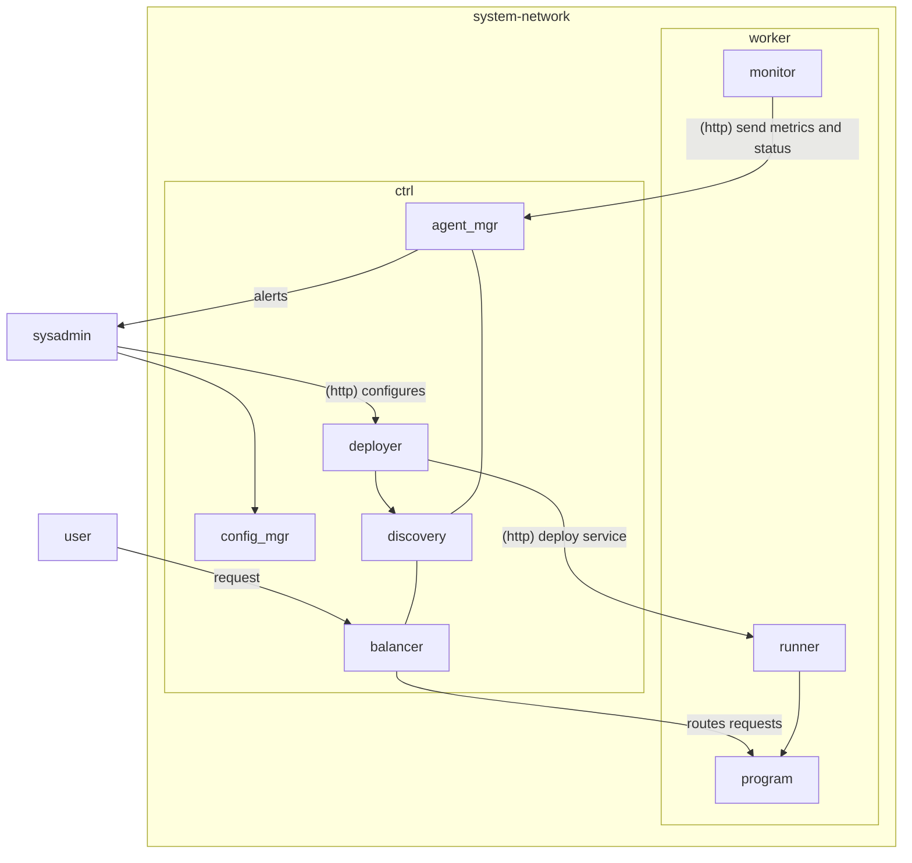
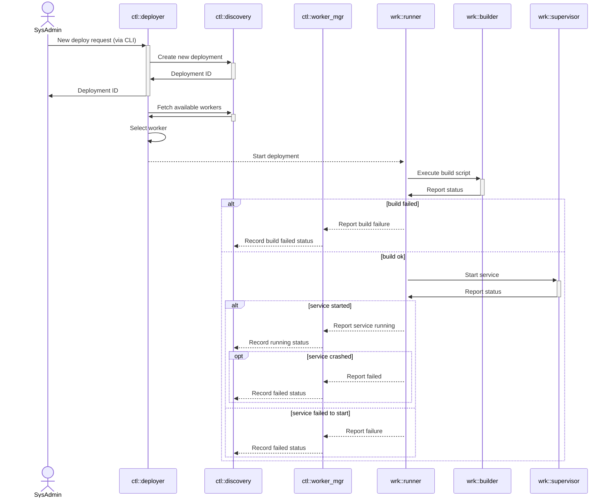

# Tucano

why use one computer if u can use 5 with Tucano lol

<p style="font-size:14px; margin: 0px; margin-top: 32px">Eduardo Lemos Paschoalini</p>
<p style="font-size:14px; margin: 0px;">Gustavo Dias Aguiar</p>
<p style="font-size:14px; margin: 0px;">Luiz Felipe Frazão</p>
<p style="font-size:14px; margin: 0px;">Yuri Rousseff</p>

<div class="abs-br m-6 flex gap-2">
  <a href="https://github.com/esfericos/tucano" target="_blank" alt="GitHub" title="Github"
    class="text-xl slidev-icon-btn opacity-50 !border-none !hover:text-white">
    <carbon-logo-github />
  </a>
</div>

---

transition: fade-out
---
<!-- END OF TUCANO -->

# Indíce

<Toc maxDepth="1"></Toc>

---

layout: default
---
<!-- END OF INDICE -->

# O que é Tucano?

<v-click>
⏰ Simples <span v-mark.red="1">scheduler de seviços</span> capaz de gerenciar workloads diversos em um sistema composto por vários computadores.

<br/>
<br/>
<v-click>
⚖ Além disso, o scheduler também é responsavel pelo <span v-mark.red="2">balanceamento de carga</span>, de modo a fazer um service discovery para rotear requisições de usuários ao seus respectivos serviços.
<br/>
<br/>
<v-click>
🖥 Uso de multiplos computadores físicos em rede local para <span v-mark.red="3">uso distribuido</span>
</v-click>
</v-click>
</v-click>

---

transition: fade-out
---
<!-- END OF "O QUE E TUCANO" -->

# Atualizações

<div style="display:flex; align-items: center; justify-content:center">



</div>

---

transition: slide-up
level: 2
---

# Atualizações

<div style="display:flex; align-items: center; justify-content:center; width: 100%">

<div style="width: 550px">


</div>
</div>

---

transition: slide-up
level: 2
---

# Atualizações

<div style="display:flex; align-items: center; justify-content:center">



</div>

---

transition: slide-up
level: 2
---

<!-- END OF ATUALIZACOES -->

# Descrição dos componentes

Explicação dos componentes dos diagramas.

## 🎮 Controller

|                      |                                                                            |
| -------------------- | -------------------------------------------------------------------------- |
| <kbd>http*</kbd>      | Recebe requisições externas dos workers ou admin e roteia para o componente correspondente |
| <kbd>deployer</kbd>  | Aceita a configuração estática de um serviço e inicia o processo de deploy |
| <kbd>balancer</kbd>  | Balaceia a carga aos nós correspondentes                                   |
| <kbd>worker_mgr</kbd>| Recebe informações dos agents e lida com eventuais "mortes" de workers.    |
| <kbd>discovery</kbd> | Mantém informações necessárias para realizar service discovery.            |

---

transition: slide-left
---

# Descrição dos componentes

Explicação dos componentes dos diagramas.

## ⚒ Worker

|                    |                                                                                         |
| ------------------ | --------------------------------------------------------------------------------------- |
| <kbd>monitor</kbd> | Coleta métricas do worker e envia periodicmente ao controlador                          |
| <kbd>runner</kbd>  | Recebe instruções de deploy e inicia o processo correspondente no worker |

---

transition: slide-up
---

# Implementação Controller

## HTTP

<div v-click style="margin-top: 24px">

* O controller usa um servidor HTTP para estabelecer comunicação com o workers e requests de SysAdmin.

<div v-click="2" style="margin-top: 24px">

* Contém rotas especificas para cada request com seus "handlers" respectivos.

</div>
</div>

---

transition: fade
level: 2
---

# Implementação Controller

## Deployer

<div v-click style="margin-top: 24px">

* Lida com o deploy e redeploy dos serviços. Também trata com a finalização do serviço.

<div v-click="2" style="margin-top: 24px">

* Parámetros passados em um deploy

```json
    "name": "Nome do serviço",
    "network": {
        "expose_port": 80
    },
    "concurrency": 3
```

</div>
</div>

---

transition: fade
level: 2
---

# Implementação Controller

## Balancer

<div v-click style="margin-top: 24px">

* Recebe requests dos usuários e roteia para o serviço correspondente

<div v-click="2" style="margin-top: 24px">

* O roteamento é descoberto pelo `HOST` da requisição HTTP. O domínio é linkado ao serviço e o `body` e `headers` da requisição original são repassadas ao serviço.

<div v-click="3" style="margin-top: 24px">

* _Por enquanto, não temos suporte ao protocolo `TLS`_

</div>
</div>
</div>

---

transition: fade
level: 2
---

# Implementação Controller

## Discovery

<div v-click style="margin-top: 24px">

* Um dos componentes mais importantes do Controller. Funciona como um database central que mantém informações sobre os workers, serviços, registros de deploys, métricas, etc.

<div v-click="2" style="margin-top: 24px">

* _Para melhorar a confiabilidade e robustez do sistema mediante a falhas, os dados são persistidos no disco, onde o armazenamento é baseado em um banco de dados SQLite_

</div>
</div>

---

transition: fade
level: 1
---

# Implementação Worker

## Collector

<div v-click style="margin-top: 24px">

* Coleta informações da máquina worker, como `CPU_Usage` e `Memory`.

<div v-click="2" style="margin-top: 24px">

* Essas informaçõe são enviadas para o controller, com o objetivo de oferecer insights para balancear a carga.

</div>
</div>

---

transition: fade
---

# Progresso do Projeto

* Documentação Concluída
* Diagrama de Deploy
* Componentes do Worker `2/3`
* Componentes do Controller `3/5`

<br/>
<br/>

> 70% - Projeto Concluído

<div style="width: 100%; background-color: #1B1B1B; height: 32px; border: solid 1px #313131; border-radius: 5px; margin-top: 8px">
<div style="width: 70%; background-color: #5D8392; height: 100%; border-radius: 5px">
</div>
</div>

---

transition: fade
---

# Metodologia

<div
  style="display: flex; align-items: flex-start; width: 100%; justify-content: space-between"
>

<blockquote v-click="1" style="width: 50%; transition: all 350ms ease;">

**📆 Reuniões semanais**

 <hr style="border-top: solid 1px gray; padding: 4px; margin-top: 8px"/>

 <p style="font-size:12px">Domingo, 09:00h - 12:00h</p>

 <p style="font-size:12px">Sexta-Feira, 10:40h - 12:20h</p>

 <p style="font-size:12px"> Rever progresso, discutir desafios, estabelecer metas</p>

 <p style="font-size:12px"> Alinhamento de prioridades e distribuição de tarefas</p>
</blockquote>

<blockquote v-click="2" style="width: 45%; transition: all 350ms ease;">

 **🔰 Reuniões Ocasionais**

 <hr style="border-top: solid 1px gray; padding: 4px; margin-top: 8px"/>

 <p style="font-size:12px">Ajustes rápidos, discussões emergenciais</p>

 <p style="font-size:12px"> Alinhamento de prioridades e distribuição de tarefas</p>

 <p style="font-size:12px">Sessões de Pair Programming</p>
</blockquote>

</div>

---

layout: center
class: text-center
---

# Obrigado

[GitHub](https://github.com/esfericos/tucano)
